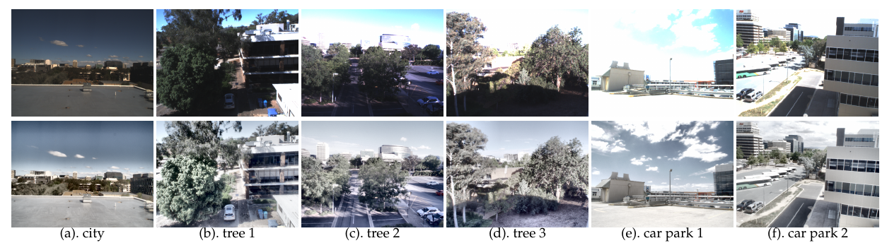

Please check out our more recent [Event-Asynchronous-Filter](https://github.com/ziweiWWANG/Event-Asynchronous-Filter) (TPAMI 2023) in the same line of work.

The [Event-based Complementary Filter](https://github.com/cedric-scheerlinck/dvs_image_reconstruction) is integrated into a unified pipeline.


# An Asynchronous Kalman Filter for Hybrid Event Cameras
<p align="center">
  <a href="https://www.youtube.com/watch?v=XPz7laloKws">
    
  </a>
</p>


Ziwei Wang, Yonhon Ng, Cedric Scheerlinck and Robert Mahony

The paper was accepted by the 2021 IEEE Int. Conf. Computer Vision (ICCV), 2021

[[Paper](https://openaccess.thecvf.com/content/ICCV2021/papers/Wang_An_Asynchronous_Kalman_Filter_for_Hybrid_Event_Cameras_ICCV_2021_paper.pdf)] [[ArXiv](https://arxiv.org/abs/2012.05590)] [[Supplementary Materials](https://openaccess.thecvf.com/content/ICCV2021/supplemental/Wang_An_Asynchronous_Kalman_ICCV_2021_supplemental.pdf)] [[GitHub](https://github.com/ziweiWWANG/AKF)]

## Citation
If you use or discuss our AKF, please cite our paper as follows:
<pre>
@inproceedings{wang2021asynchronous,
  title={An asynchronous kalman filter for hybrid event cameras},
  author={Wang, Ziwei and Ng, Yonhon and Scheerlinck, Cedric and Mahony, Robert},
  booktitle={Proceedings of the IEEE/CVF International Conference on Computer Vision},
  pages={448--457},
  year={2021}
}
</pre>

<pre>
@article{wang2023asynchronous,
  title={An Asynchronous Linear Filter Architecture for Hybrid Event-Frame Cameras},
  author={Wang, Ziwei and Ng, Yonhon and Scheerlinck, Cedric and Mahony, Robert},
  journal={IEEE Transactions on Pattern Analysis and Machine Intelligence},
  year={2023},
  publisher={IEEE}
}
</pre>


## Code - How to use


There are a few parameters that users can specify:

### In file [run_akf.m](https://github.com/ziweiWWANG/AKF/blob/main/run_akf.m):

|          Variables            | Description | Default Value |
|----------------------|----------------------|-----------------------------|
| `deblur_option`  | 1: deblur, 0: no deblur. Use the deblur option if the input images are blurry | 1                          |
| `framerate`      | the frame rate of the output image sequence in Hz                    | 300                         |
| `use_median_filter`       | a flag of applying a 3-by-3 median filter to the output images     | 0          |
| `output_high_frame_rate_flag` | 1: output images of the pre-defined framerate, 0: output images of the frame intensity framerat. | 1   |
| `sigma_p` | the process noise parameter  | 0.0005 |
| `sigma_i` | the isolated noise parameter | 0.03 |
| `sigma_r` | the refractory noise parameter | 0.05 |
| `refractory_period` | the refractory period in microsecond. It models the circuit limitations in each pixel of an event camera limit the response time of events| 10000|
|`min_ct_scale`|  the minimal value for the contrast threshold scaling factor | 0.6|
|`max_ct_scale`|  the maximal value for the contrast threshold scaling factor | 100| 
|`p_ini` | initial value for state covariance P | 0.09|

### In file [akf_reconstruction.m](https://github.com/ziweiWWANG/AKF/blob/main/akf_reconstruction.m):
1. `post_process`: 0 for no normalization; 1 for (image-min/(max-min)); 2 for user-defined maximum and minimum value for extremely bright view; 3 for user-defined maximum and minimum value for extremely dark view. Post-processing methods are important in displaying the reconstructed HDR images since the intensity values can go beyond 0 and 1; 4 for contrast-limited adaptive histogram equalization (using matlab inbuilt function `adapthisteq()`). Without a proper post-processing method, the details in the HDR part of the image (higher than 1 or lower than 0) can not be displayed. Users can adjust the pre-defined maximum and minimum value in file [output_img.m](https://github.com/ziweiWWANG/AKF/blob/main/output_img.m) to have the best visualization.
2. The `f_Q` is the most important parameter for image noise. It represents the inverse of the `R_bar` function in `equation (6)` in the paper. You can simply treat it as the image confidence function of intensity. For example, for an image in the range [0 255], the extreme values around 0 and 255 would have lower confidence. The `f_Q` is included in the provided dataset. If you are using your own dataset, you need to tune it carefully.
3. The preset exposure time for each intensity image is included in the provided datasets (some datasets are recorded with auto-exposure, e.g., [interlaken_01a_events_1_150.mat](https://drive.google.com/drive/folders/1vhgi5h4lwIjhTi-7szzpuzsJq2ewpzUm?usp=sharing)). If you want to use your own dataset, please set or estimate the exposure time as well.
4. If the exposure time for the intensity images are very short and there is almost no blurry, you can disable the deblur function by setting `deblur_option = 0`. But you still need to define an `exposure` time. 

## Datasets
Download the datasets and save them in folder `data/`.
If you want to use your datasets, define `post_process` method, `f_Q`, `exposure`, contrast threshold `ct` at the beginning of [akf_reconstruction.m](https://github.com/ziweiWWANG/AKF/blob/main/akf_reconstruction.m). See notes in the next section.

### [Click Here To Download Example Datasets](https://drive.google.com/drive/folders/1vhgi5h4lwIjhTi-7szzpuzsJq2ewpzUm?usp=sharing)
Dataset name convention: DatasetName_StartFrame_EndFrame of the original dataset (we only keep the fast motion part or highly HDR part in the sample datasets. You can download the whole dataset sequence from the website of the following papers, and test if you like). The example datasets are publicly available datasets from:
[[Mueggler et al., IJRR 2017]](https://rpg.ifi.uzh.ch/davis_data.html),
[[Scherlinck et al., ACCV 2018]](https://drive.google.com/drive/folders/1Jv73p1-Hi56HXyal4SHQbzs2zywISOvc),
[[Gehrig et al., ICRA 2021]](https://dsec.ifi.uzh.ch/).

### Our HDR Hybrid Event-Frame Dataset
Selected Images from Our HDR Hybrid Event-Frame Dataset:
<p align="center">
  <a href="https://www.youtube.com/watch?v=XPz7laloKws">
    
  </a>
</p>
First row shows the low dynamic range frames and the second row shows the high dynamic range ground truth (with tone-mapping for display only).

#### [Click Here To Download Raw Data](https://drive.google.com/drive/folders/1JYdvY2GqgD3RC-rczgf8t1JoIuBqoJvp?usp=sharing)
Raw data includes raw events, HDR ground truth images, LDR images, exposure time, etc. This can be directly used for AKF.

Example of loading our HDR dataset in Python:
```
import h5py
file_path = '../Downloads/tree3.mat'
with h5py.File(file_path, 'r') as f:
    events = f['events'][:] 
    HDR_hdr_rgb = f['HDR_mat'][:]
    image_ldr_bw = f['image'][:]
    time_image = f['time_image'][:]
```

#### [Click Here To Download Event and Frame Pairs](https://drive.google.com/drive/folders/1fH7TurmZ68WQunNP4RfTUeeMOiD7RGfX?usp=sharing)
For some methods which require event reconstruction and frame pairs, we provide reconstructed event data using the E2VID event reconstruction algorithm [[Rebecq et al., TPAMI 2019]](https://github.com/uzh-rpg/rpg_e2vid).

### Our AHDR Hybrid Event-Frame Dataset
<p align="center">
  <a href="https://www.youtube.com/watch?v=XPz7laloKws">
    
  </a>
</p>
For our AHDR dataset, we apply an artificial camera
response function to RGB camera output frames to simulate
a low dynamic range camera. The resulting image noise covariance should be high for the ‘cropped’ intensity values. You can adjust `f_Q` if needed.

Download our mountain dataset, lake dataset, and artificial camera response functions `s_curve` here:
[link](https://drive.google.com/drive/folders/1RXHQGjyit5vqO3l1LEl76XKh9MfkWwbn?usp=sharing). The datasets include raw events and SDR RGB images. Please feel free to use your own data here.

Process SDR to LDR images:
```
cut_num = 80; # Choose from 30, 50, 80, 100, 115
for i = 1:size(img_color,4)
     load(['Path_to_s_curve/s_curve_' num2str(cut_num) '.mat']);
     image(:,:,i) = s_curve(rgb2gray(img_color(:,:,:,i)) - 14);
 end
```

### Notes
1. Make sure your event and image timestamps are well aligned.
2. As a nature of the filtering methods, the quality of the reconstruction results is relevant to the quality of event camera datasets. Datasets with obvious noise recorded by hybrid event-frame cameras or lower resolution/sensitivity cameras such as [DAVIS 240](https://inivation.com/wp-content/uploads/2019/08/DAVIS240.pdf) might lead to unsatisfied results in high temporal resolution video reconstruction. The method requires a short time to adapt and converge to the optimal Kalman filter parameters for each dataset.
3. For academic use only. Should you have any questions or suggestions regarding this code and the corresponding results, please don't hesitate to get in touch with ziwei.wang1@anu.edu.au
